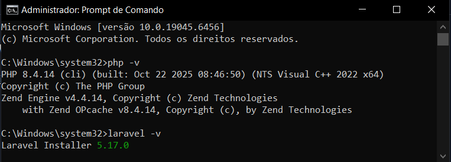
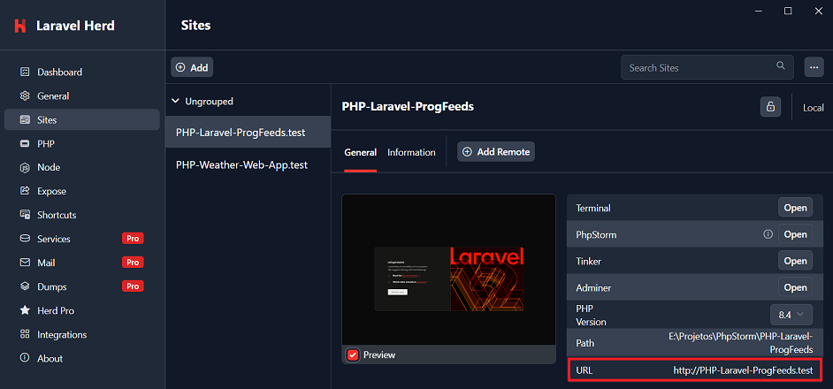
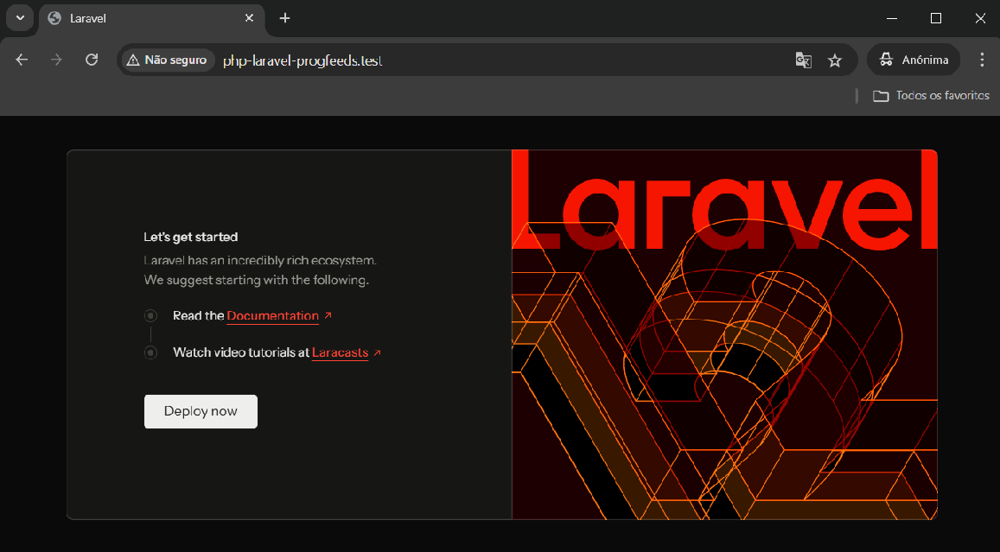

# ProgFeeds

## Development Environment
The tools and their versions used in development were:
- PHP 8.4
- Laravel 12
- Laravel Heard 1.22.3
- PHP Storm 2025.2.4

Check the PHP and Laravel installer versions with `php -v` and `laravel -v` in the terminal/cmd.

## Project Execution
Open Laravel Heard and go to Sites -> PHP-Laravel-ProgFeeds.test -> General -> URL
and verify execution in the browser.

Add the project directory to the Sites section in Laravel Heard if necessary.

## References 
Laravel - Getting Started:
https://laravel.com/learn/getting-started-with-laravel

Learn Laravel from Scratch [FULL BOOTCAMP COURSE]:
https://www.youtube.com/watch?v=MOLZOXqaomM
